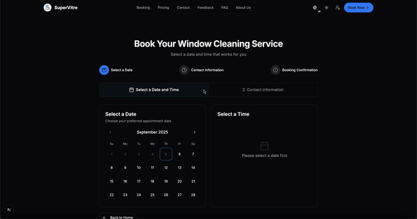

# SuperVitre

## Update

SuperVitre is a modern web application designed for managing window cleaning services. It provides features for customers to book appointments, leave feedback, and explore services, while administrators can manage appointments, feedback, and customer data.

## Features

### Customer Features
- **Online Reservations**: Book window cleaning services with ease.
- **Feedback Submission**: Share your experience and rate the service.
- **Contact Form**: Get in touch with the team for inquiries.
- **Responsive Design**: Optimized for both desktop and mobile devices.

### Admin Features
- **Dashboard**: View key metrics like appointments, revenue, and customer stats.
- **Feedback Management**: Approve, reject, or view customer feedback.
- **Customer Management**: Manage customer details and service history.
- **Appointment Management**: Track and manage appointments.

## Tech Stack

- **Frontend**: React, Next.js
- **Backend**: Firebase, Resend, Google Cloud
- **Styling**: Tailwind CSS

### Main page

### Others pages

## Contributing

Contributions are welcome!

## License

This project is licensed under the MIT License. See the [LICENSE](LICENSE) file for details.

## Contact

If you have any questions or need assistance, feel free to reach out:

- **Email**: support@supervitre.net (Email address was archived)

You can also follow us on social media for updates and promotions:

- **Facebook**: [SuperVitre](https://facebook.com/supervitre) (Deleted)
- **Instagram**: [@supervitre](https://instagram.com/supervitre) (Deleted)