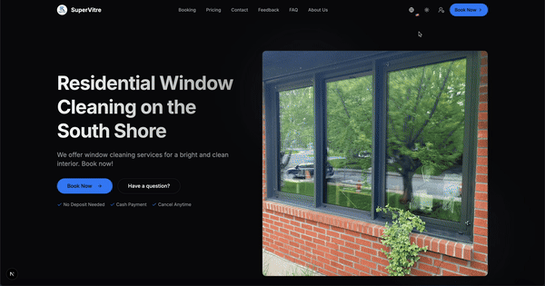
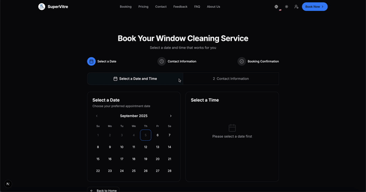

# SuperVitre

## Update

As of 19.10.2025, the website has been simplified to a static brochure. All cloud-backed features have been removed: no database, authentication, admin dashboard, online feedback, or contact forms. We no longer store user data. The site now serves only static content with phone reservation instructions.

## Overview

SuperVitre is a modern web application designed for managing window cleaning services. It provides features for customers to book appointments, leave feedback, and explore services, while administrators can manage appointments, feedback, and customer data.

## Features

### Customer Features
- Static brochure site with service info and pricing.
- Phone reservations only (no online booking).
- Responsive design (desktop and mobile).
- Accessibility: i18n-ready, light/dark mode, screen-reader labels.

### Admin Features
- None (admin dashboard removed).

## Tech Stack

- Frontend: Next.js (static pages), React
- Assets: Local /public folder
- No backend services or databases

## Main page

## Others pages

